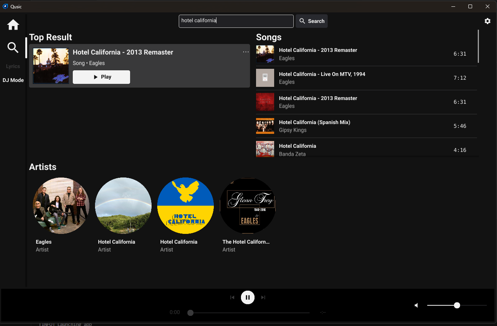
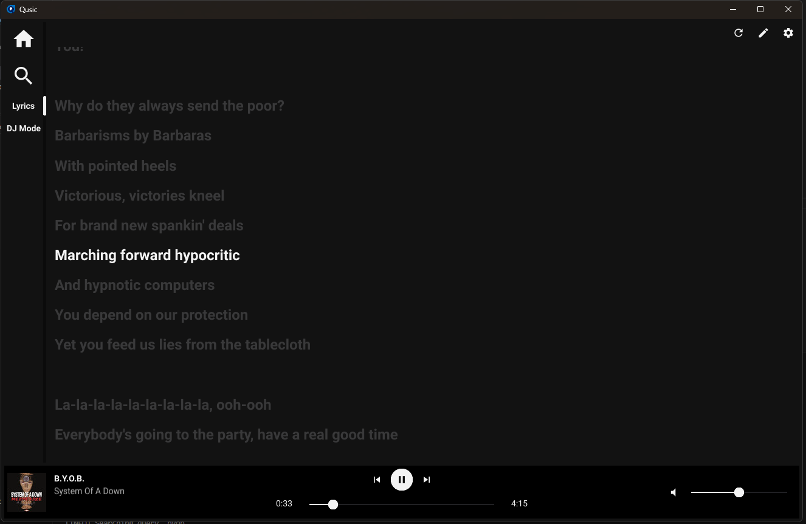

# Qusic
Free music app written in Go

## Features
- Uses YouTube Music with no need for API key
- No ads
- Timed lyrics

## Installation
### [Releases](https://github.com/oq-x/qusic/releases)

### Build from source
1. Download [Go](https://go.dev)
2. Download [MPV](https://mpv.io) (use [MSYS2](https://www.msys2.org/) for Windows)
3. Download the project, and run `go build`

## Screenshots

